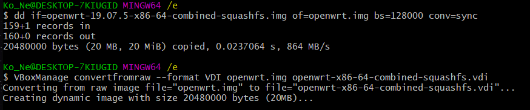
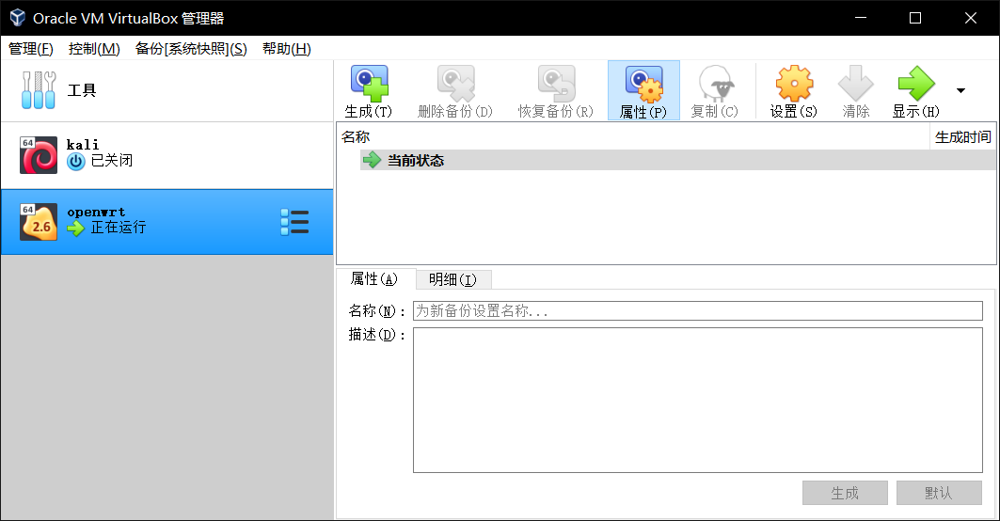
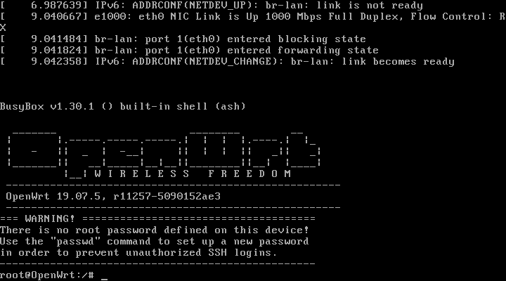
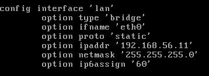
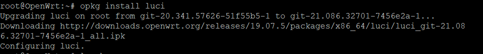
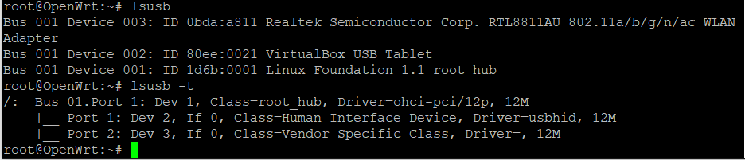
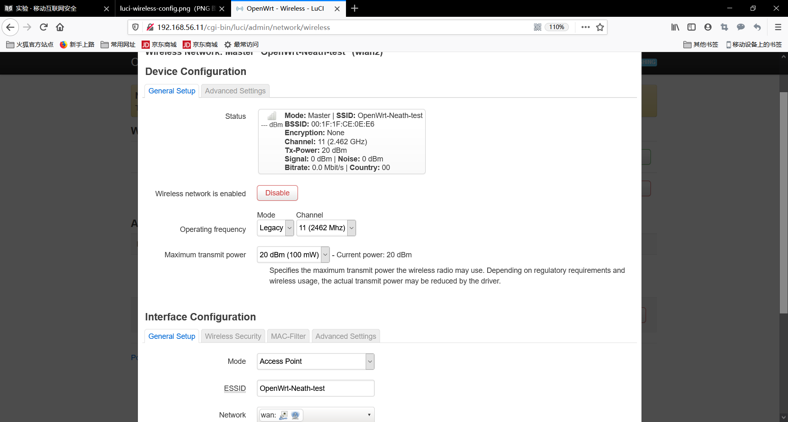
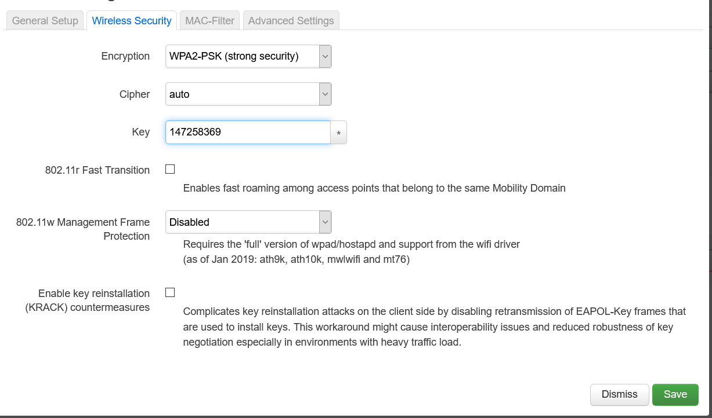
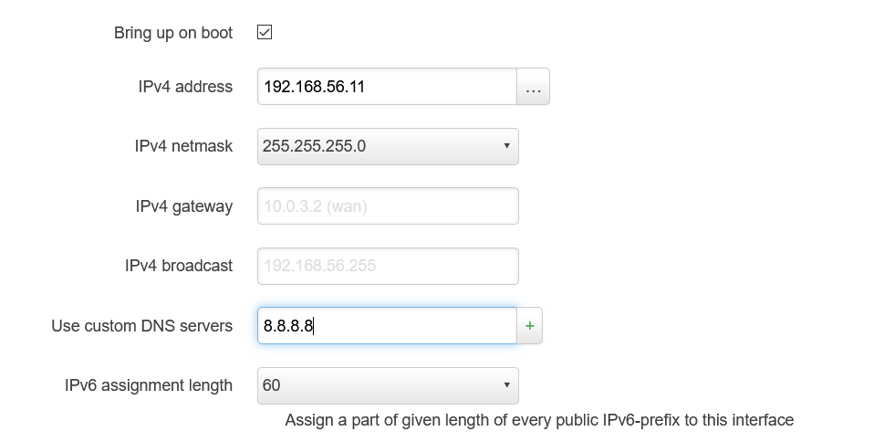

# 第一章实验报告

## 实验目的

+ 熟悉基于 OpenWrt 的无线接入点（AP）配置
+ 为第二章、第三章和第四章实验准备好「无线软 AP」环境

## 实验环境

+ 可以开启监听模式、AP 模式和数据帧注入功能的 USB 无线网卡
+ Virtualbox
+ 无线网卡：RT3070

## 实验要求

+ 对照 [第一章 实验](https://c4pr1c3.github.io/cuc-mis/chap0x01/exp.html) `无线路由器/无线接入点（AP）配置` 列的功能清单，找到在 OpenWrt 中的配置界面并截图证明；
+ 记录环境搭建步骤；
+ 如果 USB 无线网卡能在 `OpenWrt` 中正常工作，则截图证明。

## OpenWrt on VirtualBox

### 环境配置

+ 将`VBoxManage.exe`的路径添加到系统环境变量；
+ 下载[wget.exe](https://eternallybored.org/misc/wget/)。

### 安装`openwrt`

```bash
# 下载镜像文件
wget -q https://downloads.openwrt.org/releases/19.07.5/targets/x86/64/openwrt-19.07.5-x86-64-combined-squashfs.img.gz

# 解压缩
gzip -d openwrt-19.07.5-x86-64-combined-squashfs.img.gz
```


```bash
# 重新整合镜像
dd if=openwrt-19.07.5-x86-64-combined-squashfs.img of=lede.img bs=128000 conv=sync

# img 格式转换为 Virtualbox 虚拟硬盘格式 vdi
VBoxManage convertfromraw --format VDI lede.img openwrt-x86-64-combined-squashfs.vdi

# 磁盘扩容
VBoxManage modifymedium disk --resize 10240  openwrt-x86-64-combined-squashfs.vdi
```




```bash
# 新建虚拟机选择「类型」 Linux / 「版本」Linux 2.6 / 3.x / 4.x (64-bit)，填写虚拟机名称 - OpenWrt

# 内存设置为 256 MB

# 使用已有的虚拟硬盘文件 - 「注册」新虚拟硬盘文件选择刚才转换生成的 .vdi 文件

# 配置双网卡 Host-Only + NAT

# 将虚拟硬盘文件设置为多重加载

# USB设备选择USB 3.0 (xHCI)控制器

# 启动虚拟机，黑色命令行界面不再滚动更新新消息时，按下「ENTER」键即可进入 OpenWrt 的终端控制台。
```





###  `OpenWrt`配置

+ 通过 `vi` 直接编辑 `/etc/config/network` 配置文件来设置好远程管理专用网卡的 IP 地址。修改 `OpenWrt` 局域网地址为当前 Host-only 网段内可用地址，只需要修改 `option ipaddr` 的值即可。然后重启系统以使新的网络配置生效。

  

+ 安装`LuCi`软件包
  
  ```bash

  # 更新 opkg 本地缓存
  opkg update
  
  # 安装 luci
  opkg install luci
  
  # 安装好 luci 后通过浏览器访问管理 OpenWrt 
  ```

  

+ 检测网卡驱动

  ```bash
  # 安装对应的软件包以使用 lsusb 命令 
  opkg update && opkg install usbutils

  # 使用 lsusb 命令检查网卡驱动
  lsusb
  
  lsusb -t

  
  ```

  
  
+ 安装驱动

  ```bash
  #快速查找可能包含指定芯片名称的驱动程序包
  opkg find kmod-* | grep 2870
  
  #安装上述查询出的驱动
  opkg install kmod-rt2870-usb

  #安装完成后检查驱动，通过下面的截图可以看出驱动已加载
  ```

  

  
  
+ 安装`wpa-supplicant` 和 `hostapd`。

  ```bash
  # wpa-supplicant 和 hostapd 。其中 wpa-supplicant 提供 WPA 客户端认证，hostapd 提供 AP 或 ad-hoc 模式的 WPA 认证。

  opkg install hostapd wpa-supplicant
  ```

+ 重启系统，使得上述安装的配置生效。以便能够在`LuCi` 的网页版中管理无线网卡设置。能在网页版的`Network`下拉菜单中看见`Wireless`为上述操作成功的标识。

  

+ 进行下述的配置:

  + 无线网络的详细配置界面里的 `Interface Configuration` 表单里 `Network` 记得勾选 `wan` ；
  + 虚拟机的 WAN 网卡对应的虚拟网络类型必须设置为 `NAT` 而不能使用 `NatNetwork` 。无线客户端连入无线网络后才可以正常上网。
  + 不要使用 Auto 模式的信道选择和信号强度，均手工指定 才可以。

    

+ 完成无线网络配置之后，需要点击 `Enable` 按钮启用当前无线网络。下图已点击`Enable`按钮，目前无设备连接。

  
  


## `OpenWrt`使用

### 无线路由器/无线接入点（AP）配置

以下实验，默认配置的是AP，除非特别说明时会强调该实验内容需要无线路由器支持。

+ 设置AP的管理员用户名和密码

  

+ 设置SSID广播和非广播模式
  + 勾选`Hide ESSID`为非广播模式，不勾选为广播模式。

  

+ 配置不同的加密方式

  

+ 设置AP管理密码

  

+ 配置无线路由器使用自定义的DNS解析服务器

  

+ 配置DHCP和禁用DHCP

  

+ 开启路由器/AP的日志记录功能（对指定事件记录）

  

+ 配置AP隔离(WLAN划分)功能

  

+ 设置MAC地址过滤规则（ACL地址过滤器）

  

+ 查看WPS功能的支持情况

  

+ 查看AP/无线路由器支持哪些工作模式

  


## 遇到的问题

+ 手机无法连接至网络且openwrt无法扫描到任何无线网络  


+ 解决方法：无法解决，疑是硬件问题，后续再进行修复和完善
