# 无线网络嗅探基础

## 实验目的

 - 认识常见无线网络设备，了解基本使用和配置方法；
 - 掌握使用 USB 无线网卡进行无线网络嗅探的基本方法；
 - 了解无线网络嗅探的常用故障排错技术；
 - 了解使用 Wireshark 进行 802.11 协议分析的基本方法；

## 实验环境

  - 可以开启监听模式、AP 模式和数据帧注入功能的 USB 无线网卡；
  - Kali 虚拟机；
  - python scapy；
  - aircrack-ng 系列软件；
  - Wireshark；
## 实验要求
 - 详细记录实验所使用的无线网卡基本信息；

   - 无线网卡正反面高清照片；
   - 该网卡的硬件和软件特性支持情况；

 - （可选）通过无线路由器后台管理界面截图的方式，展示 自己搭建 的无线网络的基本配置信息；
 - 使用 asciinema 记录一次典型的 airodump-ng 无线嗅探操作过程（限时 1 分钟之内），在 markdown 实验报告中附上 private 分享链接；

   - 开启监听模式；
   - channel hopping 模式抓包持续 10 秒左右；
   - 指定 channel 抓包持续 10 秒左右，并记录抓包结果到文件供后续分析；

 - 使用 Wireshark 的 802.11 PSK 解密功能解密分析一个包含「浏览器访问 HTTP 明文通信网站的完整过程」的抓包结果文件；
 - 回答下列问题
    
    - 查看统计当前信号覆盖范围内一共有多少独立的SSID？其中是否包括隐藏SSID？哪些无线热点是加密/非加密的？加密方式是否可知？
    - 如何分析出一个指定手机在抓包时间窗口内在手机端的无线网络列表可以看到哪些SSID？这台手机尝试连接了哪些SSID？最终加入了哪些SSID？
    - SSID包含在哪些类型的802.11帧？
## 实验步骤
### 1.详细记录实验所使用的无线网卡基本信息  
 - 无线网卡正反面高清照片  
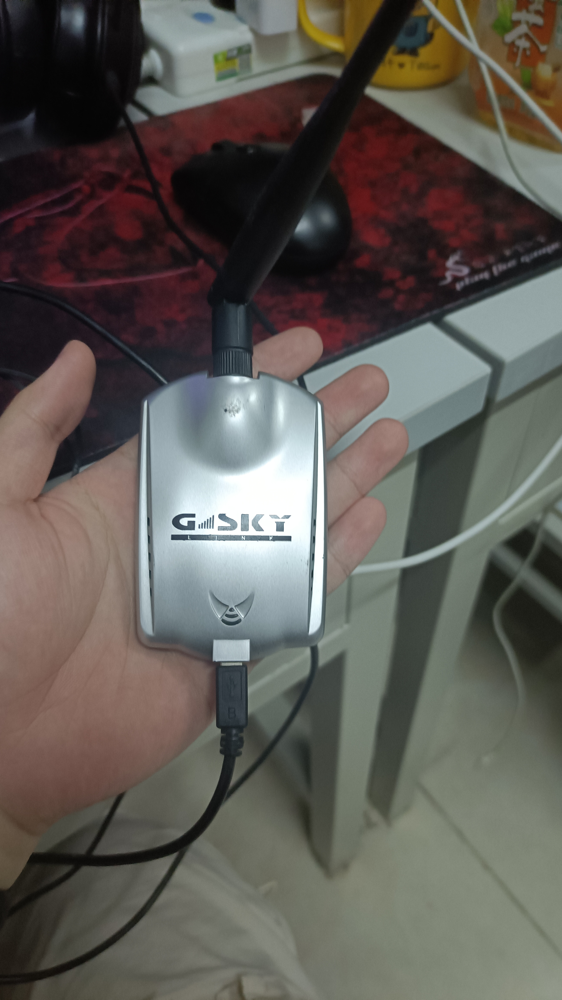  
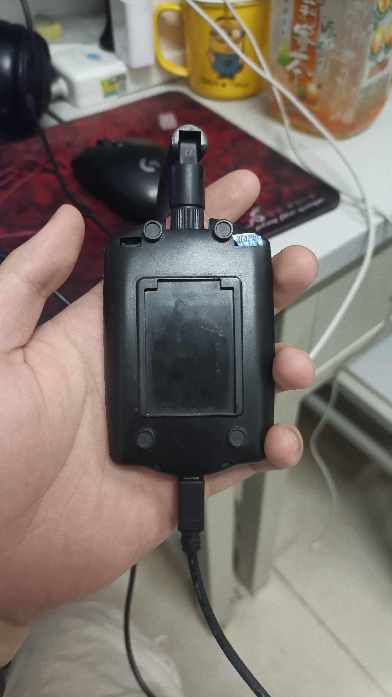  
- 该网卡的硬件和软件特性支持情况  
```
iw phy
```
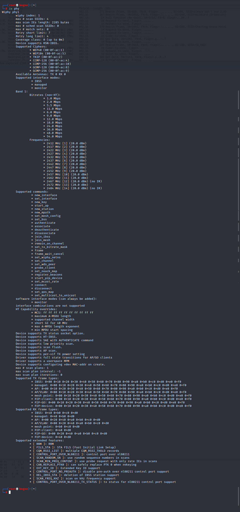
### 2.无线网络的基本配置信息(可选)

### 3.airodump-ng 无线嗅探操作过程
- 开启监听模式  
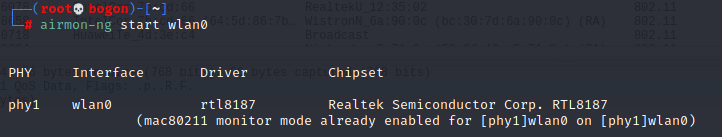
- 开始以channel hopping模式抓包  
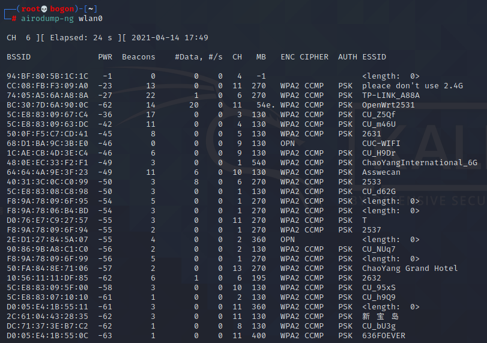
- 选择一个"感兴趣"的目标AP进行定向（指定工作channel）监听并将结果保存到本地文件  
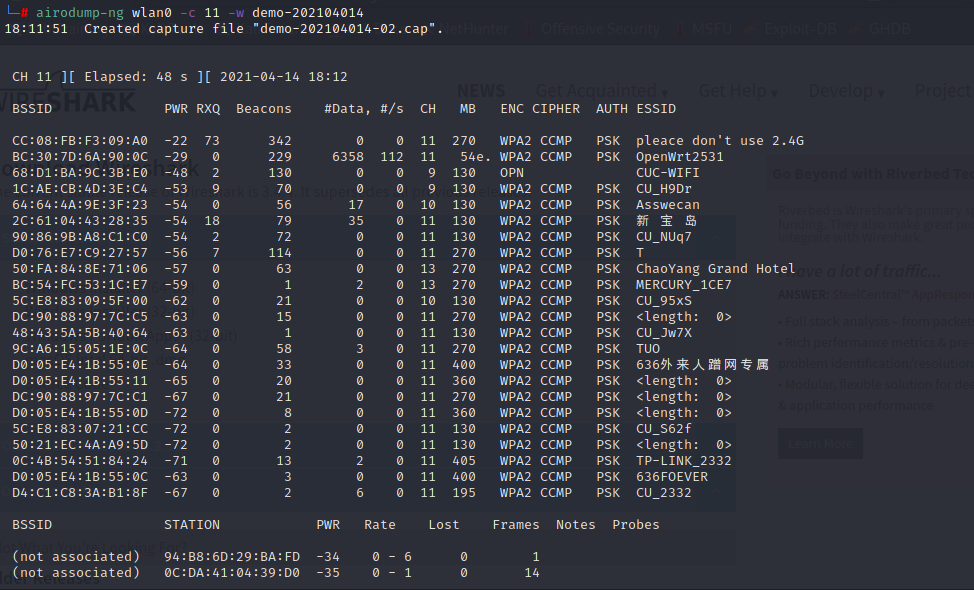
- [asciinema录像](https://asciinema.org/a/FlZG4pbV4CWxOhpOt4eCdCvSi)

### 4.使用 Wireshark 解密功能解密分析抓包结果文件
 - 经过解密可以看出正常的协议类型


### 5.回答问题
 - 5.1查看统计当前信号覆盖范围内一共有多少独立的SSID？其中是否包括隐藏SSID？哪些无线热点是加密/非加密的？加密方式是否可知？  
    - 一共有25个独立的SSID，图中SSID为wildcard的网络是隐藏的SSID。
    - 根据Beacon帧的wlan.fixed.capabilities.privacy判断
      - 值为1的为加密的无线热点
      - 值为0的为非加密的无线热点
    - 加密方式可知  
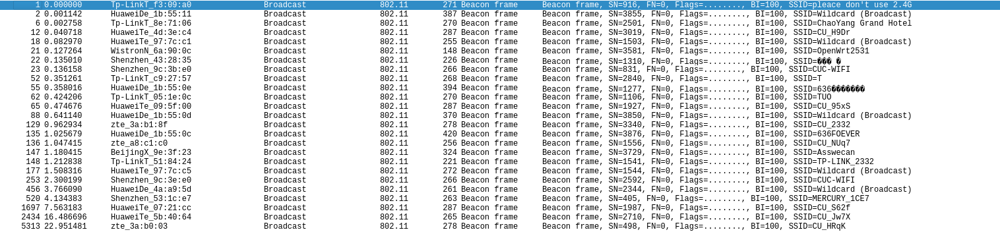  
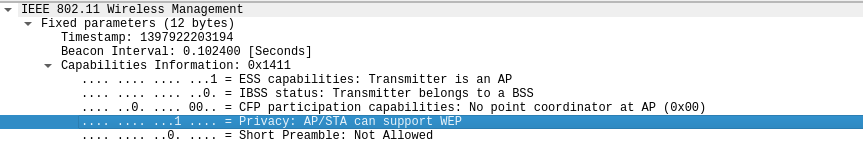  
 - 如何分析出一个指定手机在抓包时间窗口内在手机端的无线网络列表可以看到哪些SSID？这台手机尝试连接了哪些SSID？最终加入了哪些SSID？  
   -  手机MAC地址如图  
  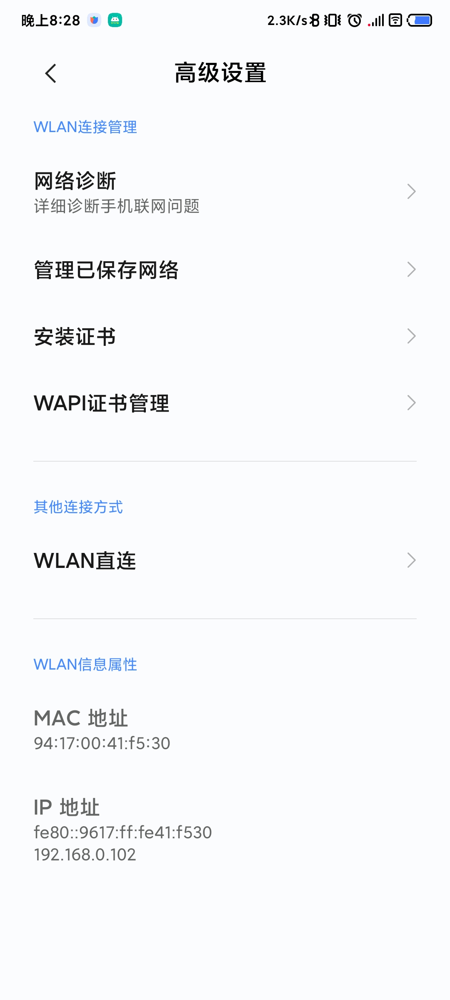
   - 在wireshark中，输入wlan.fc.type_subtype == 11过滤出authentication帧，得到手机接入的SSID
  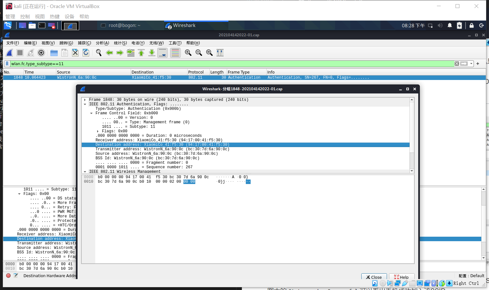
   - 通过查看手机收到的Association Response帧可以判断该手机最终加入了哪些SSID。从下图中的Status code: Successful可以看出手机成功加入该SSID  
  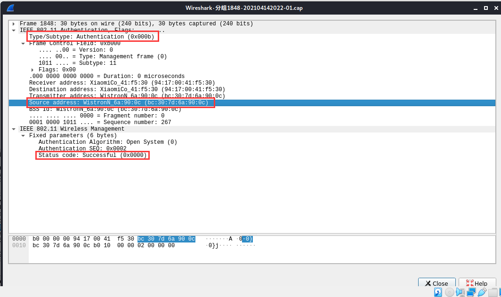
 - SSID包含在哪些类型的802.11帧？  
    - Beacon Frame（实验涉及）  
 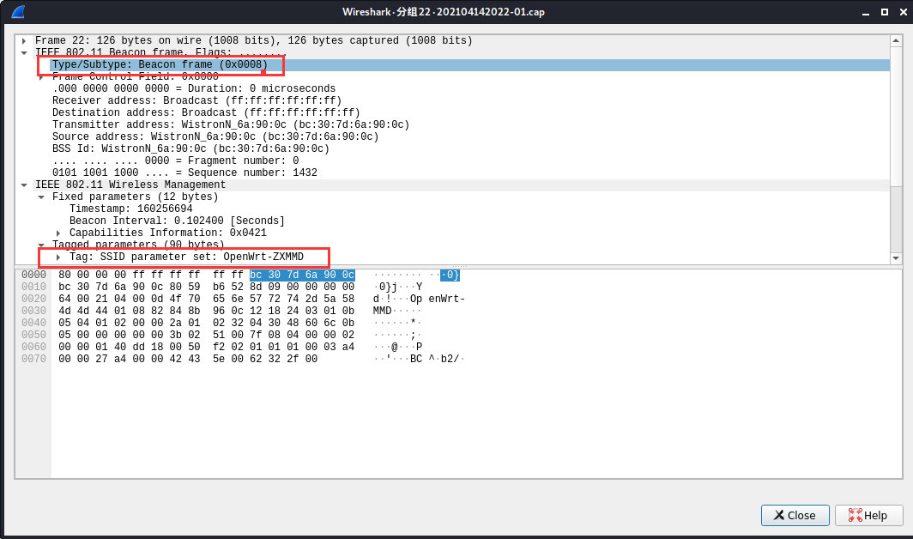
    - Probe Request（实验涉及）  
 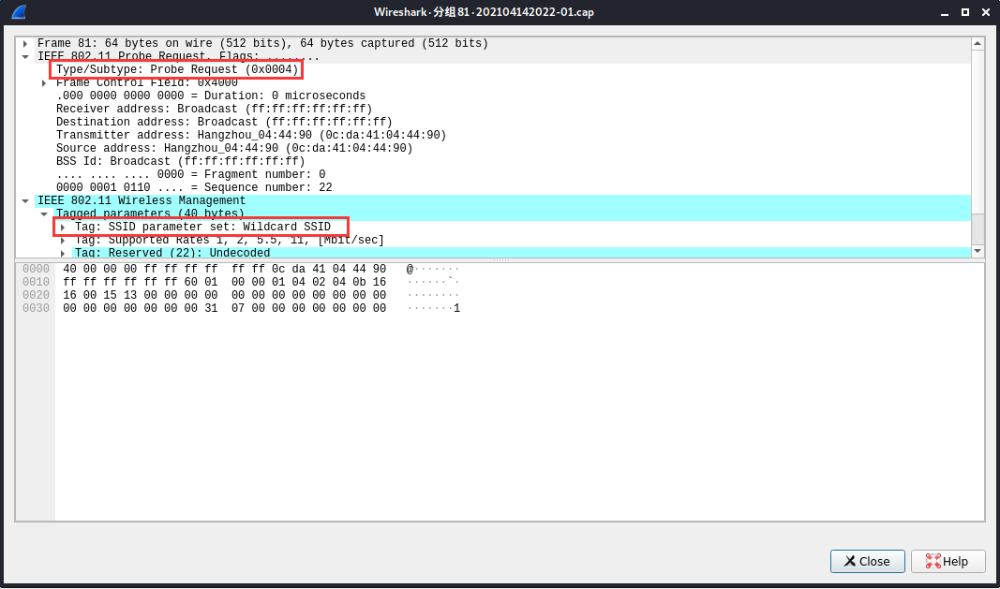
    - Probe Response（实验涉及） 
 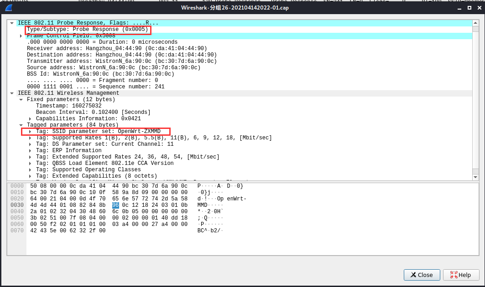
    - Association Request（实验涉及）  
 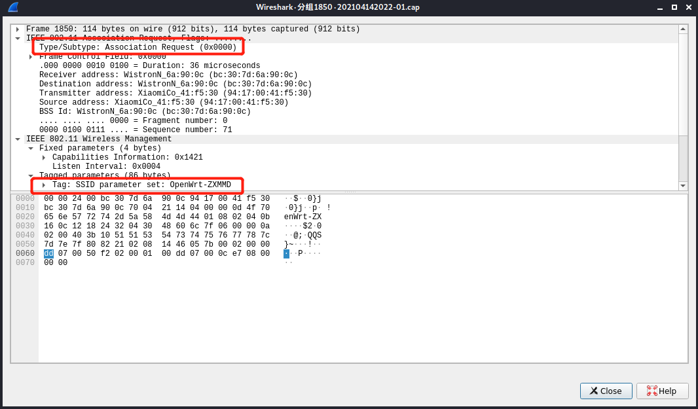
 ### 参考资料
- [jckling的实验报告](https://github.com/CUCCS/2018-NS-Public-jckling/blob/f7e8fe2bacf5aba049ee8bcfa4631476362907d4/mis-0x02/%E7%AC%AC%E4%BA%8C%E7%AB%A0%E5%AE%9E%E9%AA%8C%E7%BB%83%E4%B9%A0%E9%A2%98.md)
- [IEEE的wiki百科中关于management frames的部分](https://en.wikipedia.org/wiki/IEEE_802.11#Management_frames)
- [wireshark filter对照](https://www.semfionetworks.com/uploads/2/9/8/3/29831147/wireshark_802.11_filters_-_reference_sheet.pdf)