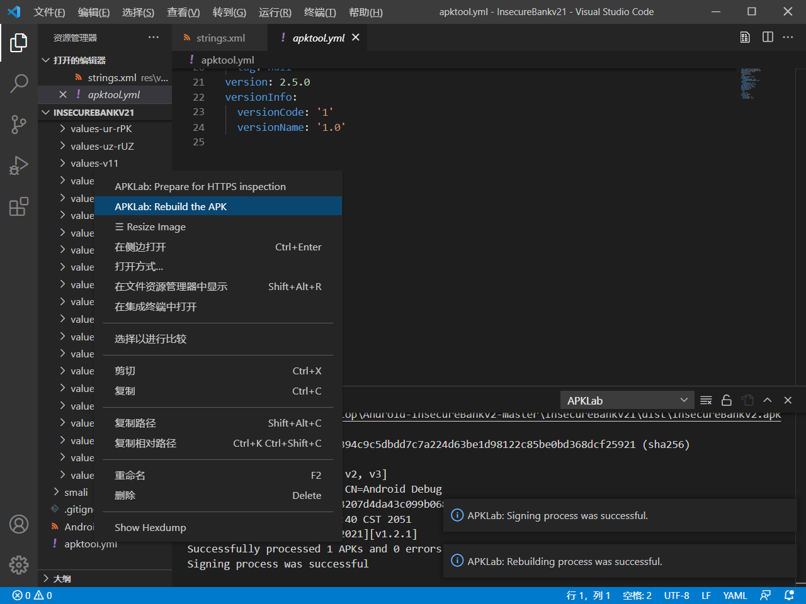

# 实验八 Android 缺陷应用漏洞攻击实验

## 实验目的

- 理解 Android 经典的组件安全和数据安全相关代码缺陷原理和漏洞利用方法

- 掌握 Android 模拟器运行环境搭建和 `ADB` 使用

## 实验环境
- win10

- Android-InsecureBankv2

- Android Studio Arctic Fox | 2020.3.1 Beta 4

- Android 11.0 API 30 x86 - Pixel 2

- Android 11.0 API 30 x86 - Pixel 4 XL

- Python 2.7

## 实验要求

-  详细记录实验环境搭建过程；

-  至少完成以下实验：

    -  Developer Backdoor
    -  Insecure Logging
    -  Android Application patching + Weak Auth
    -  Exploiting Android Broadcast Receivers
    -  Exploiting Android Content Provider

-  额外完成的实验：

    -  Exploiting Android Activities
    -  Exploiting Android Pasteboard

-  （可选）使用不同于 Walkthroughs 中提供的工具或方法达到相同的漏洞利用攻击效果；
    - 推荐 drozer

## 实验过程

### 搭建InsecureBankv2环境

- 使用的Python环境

    

- 从[InsecureBankv2](https://github.com/c4pr1c3/Android-InsecureBankv2)下载代码

- 在 `AndroLabServer` 文件夹下安装包

    ```bash
    pipenv install -r requirements.txt
    pipenv shell
    pip freeze
    python app.py
    ```

    

- 将  `InsecureBankv2.apk` 安装进模拟器

    ```bash
    adb install InsecureBankv2.apk
    ```

    


- 使用 `jack/Jack@123$`即可登陆成功

    

---

### Developer Backdoor

- 找到如下代码，从而得知后门账户为 `Devadmin`

    

- 使用后门账户时，密码任意即可登录

    

---

### Insecure Logging

- 抓取日志

    ```bash
    adb logcat
    ```

- 使用 `jack/Jack@123$` 登录


- 从日志中能找到对应操作

    

---

### Android Application patching + Weak Auth

- 使用 `apktool` 对 `apk` 文件进行反编译，反编译过程的输出信息如下：

    

- 在 `InsecureBankv2/res/values` 中找到 `strings.xml` ，将如下代码的`no`改为`yes`：

    

- 使用 `VSCode` 提供的重打包指令进行重打包

    

- 重新安装 `InsecureBankv2.apk` ，界面如下，增加了一个添加用户的功能

    

---

### Exploiting Android Broadcast Receivers

- 同上一个实验对 `apk` 文件进行反编译

- 找到反编译后的 `AndroidManifest.xml` 文件，找到如下代码：

    

- 对 `InsecureBankv2.apk` 进行逆向操作，提前下载 `dex2jar` 和 `JADX`

    ```bash
    unzip InsecureBankv2.apk

    #将classes.dex文件复制到dex2jar文件夹
    chmod +x d2j-dex2jar.sh
    chmod +x d2j_invoke.sh
    d2j-dex2jar.bat classes.dex
    ```


- 用 `JADX` 直接打开 `jar` 文件，找到 `com.android.insecurebankv2.ChangePassword` 和 `com.android.insecurebankv2.MyBroadCastReceiver` 中的代码：

    

    

- 将 `InsecureBankv2.apk` 复制到 `Android SDK` 的 `platform-tools` 文件夹下，在模拟器运行时，执行以下命令：

    ```bash
    adb install InsecureBankv2.apk
    ```

- 再次打开 `InsecureBankv2`

- 回到 `platform-tools` 文件夹并在命令行执行以下命令：

    ```bash
    adb shell am broadcast -a theBroadcast -n com.android.insecurebankv2/com.android.insecurebankv2.MyBroadCastReceiver --es phonenumber 5554 –es newpass Dinesh@123!
    ```

    

---

### Exploiting Android Content Provider

- 使用 `jack/Jack@123$` 登陆

- 同上述实验对 `apk` 文件进行反编译，找到反编译后的 `AndroidManifest.xml` 文件，找到如下代码：

    

- 同上述实验对 `InsecureBankv2.apk` 进行逆向操作，用 `JADX` 直接打开 `jar` 文件，找到如下代码：

    

- 将 `InsecureBankv2.apk` 复制到 `Android SDK` 的 `platform-tools` 文件夹下，在模拟器运行时，执行以下命令：

    ```bash
    adb install InsecureBankv2.apk
    ```

- 再次打开 `InsecureBankv2`

- 回到 `platform-tools` 文件夹并在命令行执行以下命令：

    ```bash
    adb shell content query --uri content://com.android.insecurebankv2.TrackUserContentProvider/trackerusers
    ```

- 获得记录

    

--- 

### Exploiting Android Activities (额外完成)

- 同上述实验对 `apk` 文件进行反编译，找到反编译后的 `AndroidManifest.xml` 文件，找到如下代码：

    

- 将 `InsecureBankv2.apk` 复制到 `Android SDK` 的 `platform-tools` 文件夹下，在模拟器运行时，执行以下命令：

    ```bash
    adb install InsecureBankv2.apk
    ```

- 再次打开 `InsecureBankv2` ，进入未登录界面


- 回到 `platform-tools` 文件夹并在命令行执行以下命令：

    ```bash
    adb shell am start -n com.android.insecurebankv2/.PostLogin
    ```

- 成功自动登录

    

---

### Exploiting Android Pasteboard (额外完成)

- 使用 `jack/Jack@123$` 登录，登录后进入 `Transfer` 界面

- 输入 `888888888` 并复制到剪贴板

    

- 回到命令行执行以下命令：

    ```bash
    adb shell ps | grep insecure

    adb shell su u0_a153 service call clipboard 3 s16 com.android.insecurebankv2
    ```

- 获得结果

    

---


## 实验问题
### 遇见的问题
- python2.7无法使用
- apktool无法使用
- adb命令无法使用
- 各种无法使用
- VScode中apklab下载失败
### 解决方法
- 在经过排查后发现，全部都是因为环境变量未添加上。真的烦。
- 在挂了梯子后成功的安装了apklab。
---

## 参考资料

- [第八章实验](https://c4pr1c3.github.io/cuc-mis/chap0x08/homework.html)

- [移动互联网安全（2021）](https://www.bilibili.com/video/BV1rr4y1A7nz?p=162)

- [Win10环境中如何实现python2和python3并存](https://www.jb51.net/article/191184.htm)
